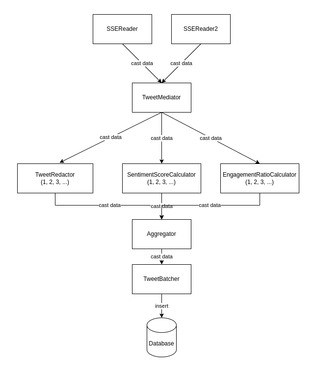

# FAF.PTR16.1 -- Project 1
> **Performed by:** Cernei Ion, group FAF-201

> **Verified by:** asist. univ. Alexandru Osadcenco

## P1 - W1 to W6
All weeks for this project aim to build upon the same application. The goal was to finish the Project with a more or less functional stream processing system. The result can be seen in the Message Flow Diagram and the Supervision Tree Diagram.


The Supervision Tree show that the project consists of several actors, the SSEReader Supervisor with the SSE Readers, then the Mediator, the TweetWorkerPool with three types of workers, the Aggregator, Batcher and finaly, the Repo, which is responsible for connecting to the database. 



The Message Flow Diagram shows the way actors communicate with each other. The SSEReaders cast the data to the Mediator. Then the Mediator casts the data further to the 3 different types of workers. After that, each worker sends its results to the Aggregator, who sends it to the Batcher which in turn inserts it into a database. 

<div style="page-break-after: always;"></div>

**SSE Reader**
```elixir   
defmodule SSEReader do
  use GenServer
  require EventsourceEx

  def start_link(url \\ []) do
    GenServer.start_link(__MODULE__, url, name: :SSEReader)
  end

  def init(url) do
    EventsourceEx.new(url, stream_to: self())
    {:ok, url}
  end

  def handle_info(data, state) do
    GenServer.cast(Process.whereis(:TweetMediator), {:tweet, data})
    {:noreply, state}
  end
end
```

This actor listens to a server-sent event (SSE) stream and forwards incoming events to another process named TweetMediator. It takes the url argument passed to start_link as its only argument. Inside init, the EventsourceEx.new function is called to create a new event source that listens to the given url and sends incoming events to the current process (which is SSEReader in this case) using stream_to: self. 

**Mediator**

The TweetMediator module is a GenServer that acts as a mediator between the stream of tweets and several worker processes responsible for processing them. The start_link function initializes the mediator process and starts the worker processes responsible for tweet redaction, sentiment score calculation, and engagement ratio calculation. The handle_cast function is called when a new tweet is received. It chooses the least busy worker processes based on their message queue length and sends the tweet data to each of them using the GenServer.cast function. The choose_worker_pid function selects the worker processes with the shortest message queue length for each task.

```elixir
defmodule TweetMediator do
  use GenServer

  ...

  def init([lambda, min_workers]) do
    IO.puts("Starting the mediator")
    {:ok, redactor_pool} = TweetPrinterPool.start_link([TweetRedactor, lambda, min_workers])

    {:ok, sentiment_calculator_pool} =
      TweetPrinterPool.start_link([SentimentScoreCalculator, lambda, min_workers])

    {:ok, engagement_ratio_pool} =
      TweetPrinterPool.start_link([EngagementRatioCalculator, lambda, min_workers])

    {:ok,
     %{
       redactor_pool: redactor_pool,
       sentiment_calculator_pool: sentiment_calculator_pool,
       engagement_ratio_pool: engagement_ratio_pool
     }}
  end

  def handle_cast({:tweet, data}, state) do
    {redactor_pid, sentiment_calculator_pid, engagement_ratio_pid} = choose_worker_pid()

    GenServer.cast(redactor_pid, {:tweet, data})
    GenServer.cast(sentiment_calculator_pid, {:tweet, data})
    GenServer.cast(engagement_ratio_pid, {:tweet, data})
    {:noreply, state}
  end

  # Least Connected
  defp choose_worker_pid() do
    ...
  end
end
```

**Tweet Worker Pool**

The TweetPrinterPool module is a Supervisor that manages a pool of workers of a certain type (TweetRedactor, SentimentScoreCalculator, or EngagementRatioCalculator).
It provides a start_link function that takes in a list of arguments ([worker_type, lambda, min_workers]) and starts the supervisor.
The init function takes in the same list of arguments and registers the supervisor with a unique name. It then initializes a list of children by creating a child specification for each worker, where the number of workers is equal to min_workers.

```elixir
defmodule TweetPrinterPool do
  use Supervisor

  ...

  def init([worker_type, lambda, min_workers]) do
    worker_name = Module.split(worker_type) |> List.last()
    IO.puts("Starting #{worker_name}Pool")
    Process.register(self(), String.to_atom("#{worker_type}Pool"))

    children =
      for i <- 1..min_workers do
        worker = {worker_type, [i, lambda]}
        Supervisor.child_spec(worker, id: i, restart: :permanent)
      end

    Supervisor.init(children, strategy: :one_for_one)
  end
```

The get_num_workers function takes in a pool_type parameter that specifies the type of worker pool to get the number of workers for. It then gets the supervisor associated with the specified pool_type, gets the list of children from the supervisor, and returns the length of the list as the number of workers.

```elixir
  def get_num_workers(pool_type) do
    supervisor_name =
      case pool_type do
        :redactor -> TweetRedactorPool
        :sentiment -> SentimentScoreCalculatorPool
        :engagement -> EngagementRatioCalculatorPool
      end

    supervisor = Process.whereis(supervisor_name)
    children = Supervisor.which_children(supervisor)
    num_workers = length(children)
    {:ok, num_workers}
  end
```

**Workers**

This is a code implementation of a Twitter analysis system in Elixir using the GenServer behaviour. There are three different modules: TweetRedactor, SentimentScoreCalculator, and EngagementRatioCalculator. Each of them implements the handle_cast/2 function to handle incoming messages of type {:tweet, message}, where message is a JSON-encoded tweet.

-- TweetRedactor

The TweetRedactor module redacts bad words from the tweet text. The handle_cast function is the function that handles incoming messages sent to the process. The function receives a tuple with a :tweet atom and a Message struct, which contains the data of the tweet. The function extracts the tweet text from the JSON data, redacts any bad words in the tweet text using the redact function, and then sends the redacted tweet to the aggregator process. The function also sleeps for a random amount of time specified by a Poisson distribution with a mean of lambda. Finally, it returns {:noreply, lambda} to indicate that the process should continue running.

```elixir
def handle_cast({:tweet, %EventsourceEx.Message{data: data}}, lambda) do
    case Jason.decode(data) do
      {:ok, json_data} ->
        tweet_id = json_data["message"]["tweet"]["id"]
        tweet_text = json_data["message"]["tweet"]["text"]
        user_id = json_data["message"]["tweet"]["user"]["id"]
        user_name = json_data["message"]["tweet"]["user"]["name"]
        redacted_text = redact(tweet_text)

        GenServer.cast(
          Process.whereis(:Aggregator),
          {:redacted_text,
           %{:text => redacted_text, :user_id => user_id, :user_name => user_name}, :id, tweet_id}
        )

        sleep_time = Statistics.Distributions.Poisson.rand(lambda) |> round()
        :timer.sleep(sleep_time)
        {:noreply, lambda}

      _ ->
        IO.puts("Error extracting tweet text from JSON data: #{data}")
        IO.puts("#{ProcessHelper.get_name(self())} DIED")
        Process.exit(self(), :kill)
        {:noreply, lambda}
    end
  end
```
The redact function takes a string of text as input and redacts any bad words in the text by replacing them with asterisks of the same length. The function splits the text into words, checks if each word is in the @bad_words list (using case-insensitive matching), and replaces the word with asterisks if it is a bad word. The function then joins the redacted words back into a string.

```elixir
  defp redact(text) do
    String.split(text, " ")
    |> Enum.map(fn word ->
      original_word = word

      if Enum.member?(@bad_words, String.downcase(word)) do
        String.duplicate("*", String.length(word))
      else
        original_word
      end
    end)
    |> Enum.join(" ")
  end
```

-- SentimentScoreCalculator

The module starts a process that listens for incoming tweets, calculates their sentiment scores using a map of emotional values, and sends the score to an aggregator process.

The handle_cast function handles incoming tweets as :tweet messages. It extracts the tweet's text from the message, calculates the sentiment score of the tweet's text, and sends the score to the aggregator process using the GenServer.cast function. The function also sleeps for a random amount of time based on a Poisson distribution with the lambda parameter.

The get_sentiment_map function makes an HTTP GET request to a local server at http://localhost:4000/emotion_values and retrieves a map of emotional values. It then converts the map into a dictionary and returns it.

```elixir
  defp get_sentiment_map() do
    {:ok, response} = HTTPoison.get("http://localhost:4000/emotion_values")
    response_body = response.body
    lines = String.split(response_body, "\r\n")

    emotional_scores =
        lines
        |> Enum.map(&String.split(&1, "\t"))
        |> Enum.reduce(%{}, fn [word, score], acc ->
        Map.merge(acc, %{word => String.to_integer(score)})
        end)
    end
```

The calculate_sentiment function calculates the sentiment score of a given tweet by splitting the tweet text into individual words, getting their corresponding emotional values from the emotional_scores dictionary, and calculating the average of the scores. If there are no scores available for the words, the function returns 0 as the sentiment score.

```elixir
  defp calculate_sentiment(text, emotional_scores) do
    words = String.split(text, " ")
    scores = words |> Enum.map(&Map.get(emotional_scores, String.downcase(&1), 0))

    sentiment_score =
      if Enum.count(scores) > 0, do: Enum.sum(scores) / Enum.count(scores), else: 0
  end
```

-- EngagementRatioCalculator

The module defines a handle_cast/2 function that receives a message containing a JSON encoded tweet and extracts the favorite_count, retweet_count, and followers_count fields from it. Using these values, it computes the engagement ratio of the tweet by calling the compute_ratio/3 function.

The compute_ratio/3 function calculates the engagement ratio by dividing the sum of the tweet's favorite_count and retweet_count by the tweet's followers_count. If the tweet has no followers, the engagement ratio is set to 0.

<div style="page-break-after: always;"></div>

```elixir
  defp compute_ratio(likes, retweets, followers) do
    engagement_ratio = if followers > 0, do: (likes + retweets) / followers, else: 0
    engagement_ratio
  end
```
The engagement ratio is then sent to the Aggregator process through a cast message, along with the tweet's ID.

**Aggregator**

The Aggregator module uses the GenServer behaviour to implement a server process that aggregates data from multiple sources. Here's a brief summary of what the module does.

The three handle_cast functions are called when the GenServer process receives a message sent using the GenServer.cast function. Each function extracts the relevant data from the message and updates the corresponding map in the state by appending the new data to the existing list of data for that message ID.

```elixir
  def handle_cast({:redacted_text, redacted_text, :id, message_id}, state) do
    redacted_tweets = Map.get(state.redacted_tweets, message_id, [])

    new_redacted_tweets = [redacted_text | redacted_tweets]

    {:noreply,
     Map.put(
       state,
       :redacted_tweets,
       Map.put(state.redacted_tweets, message_id, new_redacted_tweets)
     )}
  end
```

The handle_info function is called when the GenServer process receives a message sent using the Process.send_after function. If there are no matching sets of data in the state, the function reschedules the check for matching sets and returns the state. If there are matching sets of data, the function sends a batch of data to another GenServer process called TweetBatcher using GenServer.cast and clears the data for the matching sets in the state. The function then reschedules the check for matching sets and returns the state.

```elixir
  def handle_info(:check_aggregate, state) do
    case find_matching_set(state) do
      nil ->
        IO.puts("No match found")
        schedule_check_aggregate()
        {:noreply, state}

      matching_sets ->
        Enum.each(matching_sets, fn matching_set ->
          GenServer.cast(Process.whereis(:TweetBatcher), {:batch, matching_set})
          clear_matching_set(state, matching_set)
        end)

        schedule_check_aggregate()
        {:noreply, state}
    end
  end
```

The find_matching_set function takes the current state of the GenServer process and returns a list of matching sets of data. A matching set is a list of four items: a message ID, a redacted tweet, a sentiment score, and an engagement ratio. The function finds the set of message IDs that are present in all three maps in the state (redacted_tweets, sentiment_scores, and engagement_ratios) and returns a list of matching sets for those message IDs.

```elixir
  defp find_matching_set(state) do
    maps = [redacted_tweets, sentiment_scores, engagement_ratios]

    common_keys =
      Enum.reduce(maps, MapSet.new(Map.keys(redacted_tweets)), fn map, acc ->
        MapSet.intersection(acc, MapSet.new(Map.keys(map)))
      end)

    if MapSet.size(common_keys) > 0 do
      Enum.reduce(common_keys, [], fn key, matching_sets ->
        case {Map.fetch(redacted_tweets, key), Map.fetch(sentiment_scores, key),
              Map.fetch(engagement_ratios, key)} do
          {{:ok, [redacted_tweet]}, {:ok, [sentiment_score]}, {:ok, [engagement_ratio]}} ->
            matching_set = [key, redacted_tweet, sentiment_score, engagement_ratio]
            [matching_set | matching_sets]

          _ ->
            matching_sets
        end
      end)
    else
      nil
```

The clear_matching_set function takes the current state of the GenServer process and a matching set of data, and returns a new state with the matching set of data removed from the maps.

<div style="page-break-after: always;"></div>

**Batcher**

The purpose of this particular GenServer is to batch tweets and store them in a database. It receives batches of tweets as cast messages, and after accumulating a certain number of tweets or waiting for a certain amount of time to elapse, it writes the tweets to the database.

The handle_cast/2 function is called when the GenServer receives a cast message. It adds the matching set to the list of matching sets, and if the length of the list is equal to the batch size, it cancels the timer, and writes the tweets to the database. Otherwise, it just updates the state with the new matching sets.

```elixir
  def handle_cast({:batch, matching_set}, state) do
    new_matching_sets =
      if Enum.member?(state.matching_sets, matching_set) do
        state.matching_sets
      else
        [matching_set | state.matching_sets]
      end

    if length(new_matching_sets) == state.batch_size do
      Process.cancel_timer(state.time_ref)
      IO.puts("\nBatch of #{state.batch_size} tweets:")

      new_matching_sets
      |> Enum.map(fn matching_set ->
        user_id = matching_set |> Enum.at(1) |> Map.get(:user_id)
        user_name = matching_set |> Enum.at(1) |> Map.get(:user_name)
        tweet = matching_set |> Enum.at(1) |> Map.get(:text)
        tweet_id = matching_set |> Enum.at(0)
        sentiment = matching_set |> Enum.at(2)
        engagement = matching_set |> Enum.at(3)

        user_changeset = User.changeset(%User{}, %{id: user_id, user_name: user_name})

        tweet_changeset =
          Tweet.changeset(%Tweet{}, %{
            id: tweet_id,
            message: tweet,
            sentiment: sentiment,
            engagement: engagement,
            user_id: user_id
          })

        Tweets.Repo.insert(user_changeset, on_conflict: :nothing)
        Tweets.Repo.insert(tweet_changeset, on_conflict: :nothing)
      end)

      new_time_ref = print_after(state.time_window)
      {:noreply, %{state | matching_sets: [], time_ref: new_time_ref}}
    else
      {:noreply, %{state | matching_sets: new_matching_sets}}
```

**Database**

There are two Ecto migration files that define the database schema for the users and tweets tables.

The CreateUsers migration creates a users table with two columns: id, which is of type bigint and will be the primary key for the table, and user_name, which is of type string.

```elixir
defmodule Tweets.Repo.Migrations.CreateUsers do
  use Ecto.Migration

  def change do
    create table(:users, primary_key: false) do
      add(:id, :bigint, primary_key: true)
      add(:user_name, :string)
    end
  end
end
```

The CreateTweets migration creates a tweets table with five columns: id, which is of type bigint and will be the primary key for the table, message, which is of type string and contains the text of the tweet, sentiment, which is of type float and represents the sentiment score of the tweet, engagement, which is of type float and represents the engagement score of the tweet, and user_id, which is a foreign key that references the id column of the users table with on_delete set to :delete_all, meaning that if a user is deleted, all of their associated tweets will also be deleted.

```elixir
defmodule Tweets.Repo.Migrations.CreateTweets do
  use Ecto.Migration

  def change do
    create table(:tweets, primary_key: false) do
      add(:id, :bigint, primary_key: true)
      add(:message, :string)
      add(:sentiment, :float)
      add(:engagement, :float)
      add(:user_id, references(:users, on_delete: :delete_all))
    end
  end
end
```

<div style="page-break-after: always;"></div>

There are Ecto schemas and changesets for the users and tweets tables in a database. An Ecto schema maps external data into Elixir structs.

The User schema represents the users table, which has an id column (integer) and a user_name column (string). 

```elixir
defmodule User do
  use Ecto.Schema
  import Ecto.Changeset

  @primary_key {:id, :integer, []}
  schema "users" do
    field(:user_name, :string)
  end

  def changeset(user, params) do
    user
    |> cast(params, [:id, :user_name])
    |> unique_constraint(:id, message: "USER_EXISTS_WITH_SAME_ID")
  end
end
```

The Tweet schema represents the tweets table, which has an id column (integer), a message column (string), a sentiment column (float), an engagement column (float), and a user_id column (integer) that references the id column of the users table.

```elixir
defmodule Tweet do
  use Ecto.Schema
  import Ecto.Changeset

  @primary_key {:id, :integer, []}
  schema "tweets" do
    field(:message, :string)
    field(:sentiment, :float)
    field(:engagement, :float)
    belongs_to(:user, User, foreign_key: :user_id)
  end

  def changeset(user, params) do
    user
    |> cast(params, [:id, :message, :sentiment, :engagement, :user_id])
  end
end
```
<div style="page-break-after: always;"></div>

## Conclusion
After completing the project with the goal of building a functional stream processing system, I can conclude that it was a challenging but rewarding experience. The project involved processing live streams of data, including sentiment analysis and engagement metrics, and storing the data in a database. Overall, the project required a comprehensive understanding of stream processing systems, message flow, and supervision tree diagrams. It also demanded proficiency in the Elixir programming language and the Ecto library. By completing this project, the participants would have gained valuable experience in developing complex applications that require stream processing capabilities.

## Bibliography
https://elixir-lang.org/

https://hexdocs.pm/elixir/1.13/

https://hexdocs.pm/elixir/1.13/Supervisor.html

https://hexdocs.pm/elixir/1.13/GenServer.html

https://hexdocs.pm/ecto/getting-started.html

https://hexdocs.pm/ecto/Ecto.Repo.html

https://hexdocs.pm/ecto/Ecto.Schema.html

https://hexdocs.pm/ecto/Ecto.Changeset.html

https://hexdocs.pm/ecto_sql/Ecto.Migration.html
